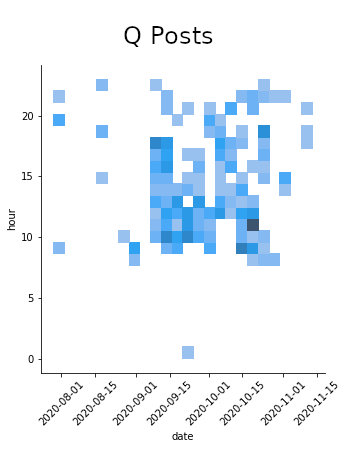

# Is this person Q?

Of the many issues facing Americans in 2020, one of the most pressing is simply, "who is Q?" Is it Jim Watkins? Priscilla Adams DuMont?

With some elementary data science and some illicitly scraped Twitter data, we might be able to answer with confidence who isn't Q.


For example, we can scrape Jim Watkins' Twitter posts and compare the time-of-day of his posts to Q drops from the same time period.


By overlaying the two and combining the data, we can look for patterns. If there isn't a big enough gap in the combined posts, one person couldn't possibly run both accounts. Even Q sleeps!





## How to use

### Installation

```pip install -r requirements.txt```


### Usage

```python q.py```

You'll be prompted for a Twitter username, and the rest of the processing should happen automatically. Save the 3 resulting figures, and use a service like [ezgif](https://ezgif.com/maker) to create a gif!

### Troubleshooting

If something goes wrong with processing the CSV data, most likely, you will have to manually edit the CSV and delete all columns except 'created_at'.
